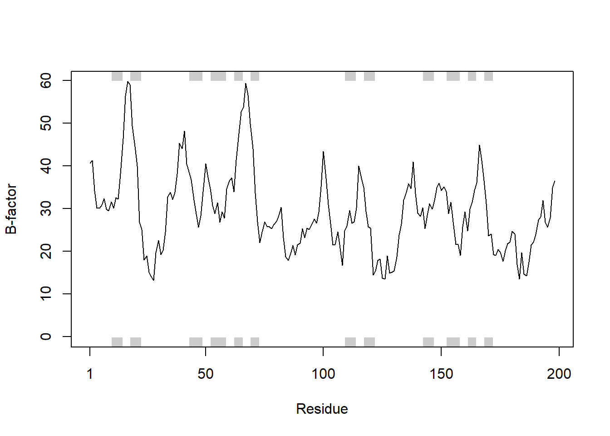
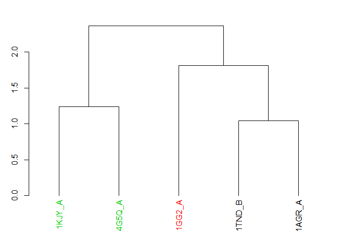
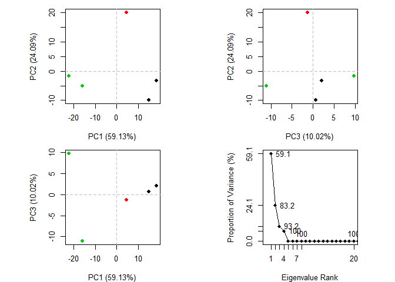
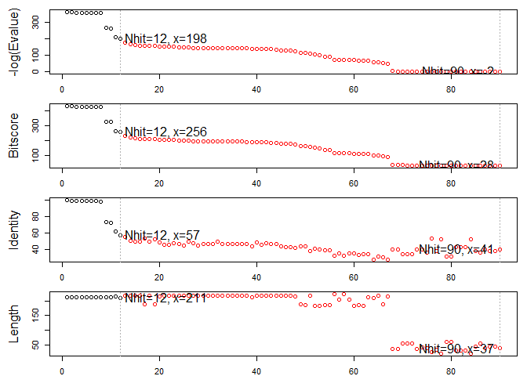

# Section 1
## PDB statistics

### Q1
Download CSV file from PDB database. Read this into R and determine fraction of X-ray structures.

```r
pdb.stats <- read.csv("Data Export Summary.csv")
```

Lets calculate something

```r
percent <- (pdb.stats$Total/ sum(pdb.stats$Total))*100
names(percent) <- pdb.stats$Experimental.Method
percent
```

```
##               X-Ray                 NMR Electron Microscopy 
##         89.51253323          8.72181096          1.50770286 
##               Other        Multi Method 
##          0.17006317          0.08788979
```

### Q2 Ans: 118 (found on webpage)

# Section 3
## Working with Bio3D

## Section 3.1
Load bio3D

```r
library(bio3d)
```

List function of bio3D package

## Section 3.2
To see example of functions

```r
#example("plot.bio3d")
```

## Section 3.3
Read 1hsg

```r
pdb <- read.pdb("1hsg")
```

```
##   Note: Accessing on-line PDB file
```

```r
pdb
```

```
## 
##  Call:  read.pdb(file = "1hsg")
## 
##    Total Models#: 1
##      Total Atoms#: 1686,  XYZs#: 5058  Chains#: 2  (values: A B)
## 
##      Protein Atoms#: 1514  (residues/Calpha atoms#: 198)
##      Nucleic acid Atoms#: 0  (residues/phosphate atoms#: 0)
## 
##      Non-protein/nucleic Atoms#: 172  (residues: 128)
##      Non-protein/nucleic resid values: [ HOH (127), MK1 (1) ]
## 
##    Protein sequence:
##       PQITLWQRPLVTIKIGGQLKEALLDTGADDTVLEEMSLPGRWKPKMIGGIGGFIKVRQYD
##       QILIEICGHKAIGTVLVGPTPVNIIGRNLLTQIGCTLNFPQITLWQRPLVTIKIGGQLKE
##       ALLDTGADDTVLEEMSLPGRWKPKMIGGIGGFIKVRQYDQILIEICGHKAIGTVLVGPTP
##       VNIIGRNLLTQIGCTLNF
## 
## + attr: atom, xyz, seqres, helix, sheet,
##         calpha, remark, call
```
### Question 6
172 non-protein residues (HOH and MK1)
1514 protein residues

### Question 6

```r
sum(pdb$atom$resid == "MK1") + sum(pdb$atom$resid == "HOH")
```

```
## [1] 172
```

```r
nrow (pdb$atom) - (sum(pdb$atom$resid == "MK1") + sum(pdb$atom$resid == "HOH"))
```

```
## [1] 1514
```
non-protein residues: water & MK1
aa residues: 1514

## Section 3.4

```r
attributes(pdb)
```

```
## $names
## [1] "atom"   "xyz"    "seqres" "helix"  "sheet"  "calpha" "remark" "call"  
## 
## $class
## [1] "pdb" "sse"
```

```r
head(pdb$atom)
```

```
##   type eleno elety  alt resid chain resno insert      x      y     z o
## 1 ATOM     1     N <NA>   PRO     A     1   <NA> 29.361 39.686 5.862 1
## 2 ATOM     2    CA <NA>   PRO     A     1   <NA> 30.307 38.663 5.319 1
## 3 ATOM     3     C <NA>   PRO     A     1   <NA> 29.760 38.071 4.022 1
## 4 ATOM     4     O <NA>   PRO     A     1   <NA> 28.600 38.302 3.676 1
## 5 ATOM     5    CB <NA>   PRO     A     1   <NA> 30.508 37.541 6.342 1
## 6 ATOM     6    CG <NA>   PRO     A     1   <NA> 29.296 37.591 7.162 1
##       b segid elesy charge
## 1 38.10  <NA>     N   <NA>
## 2 40.62  <NA>     C   <NA>
## 3 42.64  <NA>     C   <NA>
## 4 43.40  <NA>     O   <NA>
## 5 37.87  <NA>     C   <NA>
## 6 38.40  <NA>     C   <NA>
```

```r
# Print a subset of $atom data fro the first two atoms
pdb$atom[1:2, c("eleno", "elety", "x", "y","z")]
```

```
##   eleno elety      x      y     z
## 1     1     N 29.361 39.686 5.862
## 2     2    CA 30.307 38.663 5.319
```

```r
# Note that individual $atom records can also be accessed like this
pdb$atom$elety[1:2]
```

```
## [1] "N"  "CA"
```

```r
# Which allows us to do the following
plot.bio3d(pdb$atom$b[pdb$calpha], sse = pdb, typ = "l", ylab = "B-factor")
```

<!-- -->
### Question 7

```r
str(pdb$atom)
```

```
## 'data.frame':	1686 obs. of  16 variables:
##  $ type  : chr  "ATOM" "ATOM" "ATOM" "ATOM" ...
##  $ eleno : int  1 2 3 4 5 6 7 8 9 10 ...
##  $ elety : chr  "N" "CA" "C" "O" ...
##  $ alt   : chr  NA NA NA NA ...
##  $ resid : chr  "PRO" "PRO" "PRO" "PRO" ...
##  $ chain : chr  "A" "A" "A" "A" ...
##  $ resno : int  1 1 1 1 1 1 1 2 2 2 ...
##  $ insert: chr  NA NA NA NA ...
##  $ x     : num  29.4 30.3 29.8 28.6 30.5 ...
##  $ y     : num  39.7 38.7 38.1 38.3 37.5 ...
##  $ z     : num  5.86 5.32 4.02 3.68 6.34 ...
##  $ o     : num  1 1 1 1 1 1 1 1 1 1 ...
##  $ b     : num  38.1 40.6 42.6 43.4 37.9 ...
##  $ segid : chr  NA NA NA NA ...
##  $ elesy : chr  "N" "C" "C" "O" ...
##  $ charge: chr  NA NA NA NA ...
```
### Question 7
data frame


Print a summary of the coordinate data in $xyz

```r
pdb$xyz
```

```
## 
##    Total Frames#: 1
##    Total XYZs#:   5058,  (Atoms#:  1686)
## 
##     [1]  29.361  39.686  5.862  <...>  30.112  17.912  -4.791  [5058] 
## 
## + attr: Matrix DIM = 1 x 5058
```

Examine the row and column dimensions

```r
dim(pdb$xyz)
```

```
## [1]    1 5058
```

Print coordinates for the first two atom

```r
pdb$xzy[ 1, atom2xyz(1:2)]
```

```
## NULL
```

## Section 3.5
Select all C-alpha atoms (return their indices)

```r
inds <- atom.select(pdb, "calpha")
inds
```

```
## 
##  Call:  atom.select.pdb(pdb = pdb, string = "calpha")
## 
##    Atom Indices#: 198  ($atom)
##    XYZ  Indices#: 594  ($xyz)
## 
## + attr: atom, xyz, call
```

Print details of the first few selected atoms

```r
head(pdb$atom[inds$atom,])
```

```
##    type eleno elety  alt resid chain resno insert      x      y     z o
## 2  ATOM     2    CA <NA>   PRO     A     1   <NA> 30.307 38.663 5.319 1
## 9  ATOM     9    CA <NA>   GLN     A     2   <NA> 30.158 36.492 2.199 1
## 18 ATOM    18    CA <NA>   ILE     A     3   <NA> 29.123 33.098 3.397 1
## 26 ATOM    26    CA <NA>   THR     A     4   <NA> 29.774 30.143 1.062 1
## 33 ATOM    33    CA <NA>   LEU     A     5   <NA> 27.644 27.003 1.144 1
## 41 ATOM    41    CA <NA>   TRP     A     6   <NA> 30.177 24.150 1.279 1
##        b segid elesy charge
## 2  40.62  <NA>     C   <NA>
## 9  41.30  <NA>     C   <NA>
## 18 34.13  <NA>     C   <NA>
## 26 30.14  <NA>     C   <NA>
## 33 30.12  <NA>     C   <NA>
## 41 30.82  <NA>     C   <NA>
```

Print details of the first few selected xyz coordinates

```r
head(pdb$xyz[ , inds$xyz])
```

```
## [1] 30.307 38.663  5.319 30.158 36.492  2.199
```

Select other strings

```r
# Select chain A
a.inds <- atom.select(pdb, chain = "A")
# Select C-alphas of chain A
ca.inds <- atom.select(pdb, "calpha", chain = "A")
# combine multiple selection criteria to return their intersection
cab.inds <- atom.select (pdb, elety= c("CA", "CB"), chain = "A", resno = 10:20)
```

### Question 8
Looks good so lets continue to trim our PDB and write a new C-alpha only PDB file for viewing in VMD

```r
ca.pdb <- trim.pdb(pdb, inds=inds)
ca.pdb
```

```
## 
##  Call:  trim.pdb(pdb = pdb, inds = inds)
## 
##    Total Models#: 1
##      Total Atoms#: 198,  XYZs#: 594  Chains#: 2  (values: A B)
## 
##      Protein Atoms#: 198  (residues/Calpha atoms#: 198)
##      Nucleic acid Atoms#: 0  (residues/phosphate atoms#: 0)
## 
##      Non-protein/nucleic Atoms#: 0  (residues: 0)
##      Non-protein/nucleic resid values: [ none ]
## 
##    Protein sequence:
##       PQITLWQRPLVTIKIGGQLKEALLDTGADDTVLEEMSLPGRWKPKMIGGIGGFIKVRQYD
##       QILIEICGHKAIGTVLVGPTPVNIIGRNLLTQIGCTLNFPQITLWQRPLVTIKIGGQLKE
##       ALLDTGADDTVLEEMSLPGRWKPKMIGGIGGFIKVRQYDQILIEICGHKAIGTVLVGPTP
##       VNIIGRNLLTQIGCTLNF
## 
## + attr: atom, helix, sheet, seqres, xyz,
##         calpha, call
```

```r
#create file
write.pdb(ca.pdb, file = "calpha_only.pdb")
```


# Section 4
Download some example PDB files

```r
ids <- c("1TND_B", "1AGR_A", "1GG2_A", "1KJY_A", "4G5Q_A")
files <- get.pdb(ids, split = TRUE)
```

```
## Warning in get.pdb(ids, split = TRUE): ./1TND.pdb exists. Skipping download
```

```
## Warning in get.pdb(ids, split = TRUE): ./1AGR.pdb exists. Skipping download
```

```
## Warning in get.pdb(ids, split = TRUE): ./1GG2.pdb exists. Skipping download
```

```
## Warning in get.pdb(ids, split = TRUE): ./1KJY.pdb exists. Skipping download
```

```
## Warning in get.pdb(ids, split = TRUE): ./4G5Q.pdb exists. Skipping download
```

```
## 
  |                                                                       
  |                                                                 |   0%
  |                                                                       
  |=============                                                    |  20%
  |                                                                       
  |==========================                                       |  40%
  |                                                                       
  |=======================================                          |  60%
  |                                                                       
  |====================================================             |  80%
  |                                                                       
  |=================================================================| 100%
```

Extract and align the chains we are interested in

```r
pdbs <- pdbaln(files, fit = TRUE, exefile = "C:/Users/Gracie/Downloads/muscle.exe")
```

```
## Reading PDB files:
## ./split_chain/1TND_B.pdb
## ./split_chain/1AGR_A.pdb
## ./split_chain/1GG2_A.pdb
## ./split_chain/1KJY_A.pdb
## ./split_chain/4G5Q_A.pdb
## ....   PDB has ALT records, taking A only, rm.alt=TRUE
## .
## 
## Extracting sequences
## 
## pdb/seq: 1   name: ./split_chain/1TND_B.pdb 
## pdb/seq: 2   name: ./split_chain/1AGR_A.pdb 
## pdb/seq: 3   name: ./split_chain/1GG2_A.pdb 
## pdb/seq: 4   name: ./split_chain/1KJY_A.pdb 
## pdb/seq: 5   name: ./split_chain/4G5Q_A.pdb 
##    PDB has ALT records, taking A only, rm.alt=TRUE
```

```r
pdbs
```

```
##                                1        .         .         .         .         50 
## [Truncated_Name:1]1TND_B.pdb   --------------------------ARTVKLLLLGAGESGKSTIVKQMK
## [Truncated_Name:2]1AGR_A.pdb   LSAEDKAAVERSKMIDRNLREDGEKAAREVKLLLLGAGESGKSTIVKQMK
## [Truncated_Name:3]1GG2_A.pdb   LSAEDKAAVERSKMIDRNLREDGEKAAREVKLLLLGAGESGKSTIVKQMK
## [Truncated_Name:4]1KJY_A.pdb   -------------------------GAREVKLLLLGAGESGKSTIVKQMK
## [Truncated_Name:5]4G5Q_A.pdb   --------------------------AREVKLLLLGAGESGKSTIVKQMK
##                                                          ** ********************* 
##                                1        .         .         .         .         50 
## 
##                               51        .         .         .         .         100 
## [Truncated_Name:1]1TND_B.pdb   IIHQDGYSLEECLEFIAIIYGNTLQSILAIVRAMTTLNIQYGDSARQDDA
## [Truncated_Name:2]1AGR_A.pdb   IIHEAGYSEEECKQYKAVVYSNTIQSIIAIIRAMGRLKIDFGDAARADDA
## [Truncated_Name:3]1GG2_A.pdb   IIHEAGYSEEECKQYKAVVYSNTIQSIIAIIRAMGRLKIDFGDAARADDA
## [Truncated_Name:4]1KJY_A.pdb   IIHEAGYSEEECKQYKAVVYSNTIQSIIAIIRAMGRLKIDFGDSARADDA
## [Truncated_Name:5]4G5Q_A.pdb   IIHEAGYSEEECKQYKAVVYSNTIQSIIAIIRAMGRLKIDFGDSARADDA
##                                ***  *** ***  ^ *^^* **^***^**^***  * * ^** ** *** 
##                               51        .         .         .         .         100 
## 
##                              101        .         .         .         .         150 
## [Truncated_Name:1]1TND_B.pdb   RKLMHMADTIEEGTMPKEMSDIIQRLWKDSGIQACFDRASEYQLNDSAGY
## [Truncated_Name:2]1AGR_A.pdb   RQLFVLAGAAEEGFMTAELAGVIKRLWKDSGVQACFNRSREYQLNDSAAY
## [Truncated_Name:3]1GG2_A.pdb   RQLFVLAGAAEEGFMTAELAGVIKRLWKDSGVQACFNRSREYQLNDSAAY
## [Truncated_Name:4]1KJY_A.pdb   RQLFVLAGAAEEGFMTAELAGVIKRLWKDSGVQACFNRSREYQLNDSAAY
## [Truncated_Name:5]4G5Q_A.pdb   RQLFVLAGAAEEGFMTAELAGVIKRLWKDSGVQACFNRSREYQLNDSAAY
##                                * *  ^*   *** *  *^  ^* *******^**** *  ********^* 
##                              101        .         .         .         .         150 
## 
##                              151        .         .         .         .         200 
## [Truncated_Name:1]1TND_B.pdb   YLSDLERLVTPGYVPTEQDVLRSRVKTTGIIETQFSFKDLNFRMFDVGGQ
## [Truncated_Name:2]1AGR_A.pdb   YLNDLDRIAQPNYIPTQQDVLRTRVKTTGIVETHFTFKDLHFKMFDVGGQ
## [Truncated_Name:3]1GG2_A.pdb   YLNDLDRIAQPNYIPTQQDVLRTRVKTTGIVETHFTFKDLHFKMFDVGAQ
## [Truncated_Name:4]1KJY_A.pdb   YLNDLDRIAQPNYIPTQQDVLRTRVKTTGIVETHFTFKDLHFKMFDVGGQ
## [Truncated_Name:5]4G5Q_A.pdb   YLNDLDRIAQPNYIPTQQDVLRTRVKTTGIVETHFTFKDLHFKMFDVGGQ
##                                ** **^*^  * *^** *****^*******^** *^**** *^*****^* 
##                              151        .         .         .         .         200 
## 
##                              201        .         .         .         .         250 
## [Truncated_Name:1]1TND_B.pdb   RSERKKWIHCFEGVTCIIFIAALSAYDMVLVEDDEVNRMHESLHLFNSIC
## [Truncated_Name:2]1AGR_A.pdb   RSERKKWIHCFEGVTAIIFCVALSDYDLVLAEDEEMNRMHESMKLFDSIC
## [Truncated_Name:3]1GG2_A.pdb   RSERKKWIHCFEGVTAIIFCVALSDYDLVLAEDEEMNRMHESMKLFDSIC
## [Truncated_Name:4]1KJY_A.pdb   RSERKKWIHCFEGVTAIIFCVALSDYDLVLAEDEEMNRMHESMKLFDSIC
## [Truncated_Name:5]4G5Q_A.pdb   RSERKKWIHCFEGVTAIIFCVALSDYDLVLAEDEEMNRMHESMKLFDSIC
##                                *************** ***  *** **^** **^*^******^^** *** 
##                              201        .         .         .         .         250 
## 
##                              251        .         .         .         .         300 
## [Truncated_Name:1]1TND_B.pdb   NHRYFATTSIVLFLNKKDVFSEKIKKAHLSICFPDYNGPNTYEDAGNYIK
## [Truncated_Name:2]1AGR_A.pdb   NNKWFTDTSIILFLNKKDLFEEKIKKSPLTICYPEYAGSNTYEEAAAYIQ
## [Truncated_Name:3]1GG2_A.pdb   NNKWFTDTSIILFLNKKDLFEEKIKKSPLTICYPEYAGSNTYEEAAAYIQ
## [Truncated_Name:4]1KJY_A.pdb   NNKWFTDTSIILFLNKKDLFEEKIKKSPLTICYPEYAGSNTYEEAAAYIQ
## [Truncated_Name:5]4G5Q_A.pdb   NNKWFTDTSIILFLNKKDLFEEKIKKSPLTICYPEYAGSNTYEEAAAYIQ
##                                * ^^*  ***^*******^* *****  *^**^*^* * ****^*^ **  
##                              251        .         .         .         .         300 
## 
##                              301        .         .         .         .         350 
## [Truncated_Name:1]1TND_B.pdb   VQFLELNMRRDVKEIYSHMTCATDTQNVKFVFDAVTDIIIKE--------
## [Truncated_Name:2]1AGR_A.pdb   CQFEDLNKRKDTKEIYTHFTCATDTKNVQFVFDAVTDVIIKNNLKDCGLF
## [Truncated_Name:3]1GG2_A.pdb   CQFEDLNKRKDTKEIYTHFTCATDTKNVQFVFDAVTDVIIKNNL------
## [Truncated_Name:4]1KJY_A.pdb   CQFEDLNKRKDTKEIYTHFTCATDTKNVQFVFDAVTDVIIKNNLK-----
## [Truncated_Name:5]4G5Q_A.pdb   CQFEDLNKRKDTKEIYTHFTCATDTKNVQFVFDAVTDVIIKNNLKD----
##                                 ** ^** *^* ****^* ****** ** ********^***          
##                              301        .         .         .         .         350 
## 
## Call:
##   pdbaln(files = files, fit = TRUE, exefile = "C:/Users/Gracie/Downloads/muscle.exe")
## 
## Class:
##   pdbs, fasta
## 
## Alignment dimensions:
##   5 sequence rows; 350 position columns (316 non-gap, 34 gap) 
## 
## + attr: xyz, resno, b, chain, id, ali, resid, sse, call
```
### Question 8
fit = TRUE in the rmsd() function performs coordinate superpostition before RMSD calculation


```r
summary(pdbs)
```

```
##       Length Class  Mode     
## xyz   5250   xyz    numeric  
## resno 1750   -none- numeric  
## b     1750   -none- numeric  
## chain 1750   -none- character
## id       5   -none- character
## ali   1750   -none- character
## resid 1750   -none- character
## sse   1750   -none- character
## call     4   -none- call
```

Access the first 5 rows, and 8 columns

```r
pdbs$ali[1:5, 1:8]
```

```
##                          [,1] [,2] [,3] [,4] [,5] [,6] [,7] [,8]
## ./split_chain/1TND_B.pdb "-"  "-"  "-"  "-"  "-"  "-"  "-"  "-" 
## ./split_chain/1AGR_A.pdb "L"  "S"  "A"  "E"  "D"  "K"  "A"  "A" 
## ./split_chain/1GG2_A.pdb "L"  "S"  "A"  "E"  "D"  "K"  "A"  "A" 
## ./split_chain/1KJY_A.pdb "-"  "-"  "-"  "-"  "-"  "-"  "-"  "-" 
## ./split_chain/4G5Q_A.pdb "-"  "-"  "-"  "-"  "-"  "-"  "-"  "-"
```

Associated residues numbers

```r
pdbs$resno[1:5, 1:8]
```

```
##                          [,1] [,2] [,3] [,4] [,5] [,6] [,7] [,8]
## ./split_chain/1TND_B.pdb   NA   NA   NA   NA   NA   NA   NA   NA
## ./split_chain/1AGR_A.pdb    5    6    7    8    9   10   11   12
## ./split_chain/1GG2_A.pdb    5    6    7    8    9   10   11   12
## ./split_chain/1KJY_A.pdb   NA   NA   NA   NA   NA   NA   NA   NA
## ./split_chain/4G5Q_A.pdb   NA   NA   NA   NA   NA   NA   NA   NA
```

Inspect alignment for gaps

```r
gaps <- gap.inspect(pdbs$ali)
gaps
```

```
## $t.inds
##  [1]   1   2   3   4   5   6   7   8   9  10  11  12  13  14  15  16  17
## [18]  18  19  20  21  22  23  24  25  26 343 344 345 346 347 348 349 350
## 
## $f.inds
##   [1]  27  28  29  30  31  32  33  34  35  36  37  38  39  40  41  42  43
##  [18]  44  45  46  47  48  49  50  51  52  53  54  55  56  57  58  59  60
##  [35]  61  62  63  64  65  66  67  68  69  70  71  72  73  74  75  76  77
##  [52]  78  79  80  81  82  83  84  85  86  87  88  89  90  91  92  93  94
##  [69]  95  96  97  98  99 100 101 102 103 104 105 106 107 108 109 110 111
##  [86] 112 113 114 115 116 117 118 119 120 121 122 123 124 125 126 127 128
## [103] 129 130 131 132 133 134 135 136 137 138 139 140 141 142 143 144 145
## [120] 146 147 148 149 150 151 152 153 154 155 156 157 158 159 160 161 162
## [137] 163 164 165 166 167 168 169 170 171 172 173 174 175 176 177 178 179
## [154] 180 181 182 183 184 185 186 187 188 189 190 191 192 193 194 195 196
## [171] 197 198 199 200 201 202 203 204 205 206 207 208 209 210 211 212 213
## [188] 214 215 216 217 218 219 220 221 222 223 224 225 226 227 228 229 230
## [205] 231 232 233 234 235 236 237 238 239 240 241 242 243 244 245 246 247
## [222] 248 249 250 251 252 253 254 255 256 257 258 259 260 261 262 263 264
## [239] 265 266 267 268 269 270 271 272 273 274 275 276 277 278 279 280 281
## [256] 282 283 284 285 286 287 288 289 290 291 292 293 294 295 296 297 298
## [273] 299 300 301 302 303 304 305 306 307 308 309 310 311 312 313 314 315
## [290] 316 317 318 319 320 321 322 323 324 325 326 327 328 329 330 331 332
## [307] 333 334 335 336 337 338 339 340 341 342
## 
## $row
## [1] 34  0  6 30 30
## 
## $col
##   [1] 3 3 3 3 3 3 3 3 3 3 3 3 3 3 3 3 3 3 3 3 3 3 3 3 3 2 0 0 0 0 0 0 0 0 0
##  [36] 0 0 0 0 0 0 0 0 0 0 0 0 0 0 0 0 0 0 0 0 0 0 0 0 0 0 0 0 0 0 0 0 0 0 0
##  [71] 0 0 0 0 0 0 0 0 0 0 0 0 0 0 0 0 0 0 0 0 0 0 0 0 0 0 0 0 0 0 0 0 0 0 0
## [106] 0 0 0 0 0 0 0 0 0 0 0 0 0 0 0 0 0 0 0 0 0 0 0 0 0 0 0 0 0 0 0 0 0 0 0
## [141] 0 0 0 0 0 0 0 0 0 0 0 0 0 0 0 0 0 0 0 0 0 0 0 0 0 0 0 0 0 0 0 0 0 0 0
## [176] 0 0 0 0 0 0 0 0 0 0 0 0 0 0 0 0 0 0 0 0 0 0 0 0 0 0 0 0 0 0 0 0 0 0 0
## [211] 0 0 0 0 0 0 0 0 0 0 0 0 0 0 0 0 0 0 0 0 0 0 0 0 0 0 0 0 0 0 0 0 0 0 0
## [246] 0 0 0 0 0 0 0 0 0 0 0 0 0 0 0 0 0 0 0 0 0 0 0 0 0 0 0 0 0 0 0 0 0 0 0
## [281] 0 0 0 0 0 0 0 0 0 0 0 0 0 0 0 0 0 0 0 0 0 0 0 0 0 0 0 0 0 0 0 0 0 0 0
## [316] 0 0 0 0 0 0 0 0 0 0 0 0 0 0 0 0 0 0 0 0 0 0 0 0 0 0 0 1 1 2 3 4 4 4 4
## 
## $bin
##      [,1] [,2] [,3] [,4] [,5] [,6] [,7] [,8] [,9] [,10] [,11] [,12] [,13]
## [1,]    1    1    1    1    1    1    1    1    1     1     1     1     1
## [2,]    0    0    0    0    0    0    0    0    0     0     0     0     0
## [3,]    0    0    0    0    0    0    0    0    0     0     0     0     0
## [4,]    1    1    1    1    1    1    1    1    1     1     1     1     1
## [5,]    1    1    1    1    1    1    1    1    1     1     1     1     1
##      [,14] [,15] [,16] [,17] [,18] [,19] [,20] [,21] [,22] [,23] [,24]
## [1,]     1     1     1     1     1     1     1     1     1     1     1
## [2,]     0     0     0     0     0     0     0     0     0     0     0
## [3,]     0     0     0     0     0     0     0     0     0     0     0
## [4,]     1     1     1     1     1     1     1     1     1     1     1
## [5,]     1     1     1     1     1     1     1     1     1     1     1
##      [,25] [,26] [,27] [,28] [,29] [,30] [,31] [,32] [,33] [,34] [,35]
## [1,]     1     1     0     0     0     0     0     0     0     0     0
## [2,]     0     0     0     0     0     0     0     0     0     0     0
## [3,]     0     0     0     0     0     0     0     0     0     0     0
## [4,]     1     0     0     0     0     0     0     0     0     0     0
## [5,]     1     1     0     0     0     0     0     0     0     0     0
##      [,36] [,37] [,38] [,39] [,40] [,41] [,42] [,43] [,44] [,45] [,46]
## [1,]     0     0     0     0     0     0     0     0     0     0     0
## [2,]     0     0     0     0     0     0     0     0     0     0     0
## [3,]     0     0     0     0     0     0     0     0     0     0     0
## [4,]     0     0     0     0     0     0     0     0     0     0     0
## [5,]     0     0     0     0     0     0     0     0     0     0     0
##      [,47] [,48] [,49] [,50] [,51] [,52] [,53] [,54] [,55] [,56] [,57]
## [1,]     0     0     0     0     0     0     0     0     0     0     0
## [2,]     0     0     0     0     0     0     0     0     0     0     0
## [3,]     0     0     0     0     0     0     0     0     0     0     0
## [4,]     0     0     0     0     0     0     0     0     0     0     0
## [5,]     0     0     0     0     0     0     0     0     0     0     0
##      [,58] [,59] [,60] [,61] [,62] [,63] [,64] [,65] [,66] [,67] [,68]
## [1,]     0     0     0     0     0     0     0     0     0     0     0
## [2,]     0     0     0     0     0     0     0     0     0     0     0
## [3,]     0     0     0     0     0     0     0     0     0     0     0
## [4,]     0     0     0     0     0     0     0     0     0     0     0
## [5,]     0     0     0     0     0     0     0     0     0     0     0
##      [,69] [,70] [,71] [,72] [,73] [,74] [,75] [,76] [,77] [,78] [,79]
## [1,]     0     0     0     0     0     0     0     0     0     0     0
## [2,]     0     0     0     0     0     0     0     0     0     0     0
## [3,]     0     0     0     0     0     0     0     0     0     0     0
## [4,]     0     0     0     0     0     0     0     0     0     0     0
## [5,]     0     0     0     0     0     0     0     0     0     0     0
##      [,80] [,81] [,82] [,83] [,84] [,85] [,86] [,87] [,88] [,89] [,90]
## [1,]     0     0     0     0     0     0     0     0     0     0     0
## [2,]     0     0     0     0     0     0     0     0     0     0     0
## [3,]     0     0     0     0     0     0     0     0     0     0     0
## [4,]     0     0     0     0     0     0     0     0     0     0     0
## [5,]     0     0     0     0     0     0     0     0     0     0     0
##      [,91] [,92] [,93] [,94] [,95] [,96] [,97] [,98] [,99] [,100] [,101]
## [1,]     0     0     0     0     0     0     0     0     0      0      0
## [2,]     0     0     0     0     0     0     0     0     0      0      0
## [3,]     0     0     0     0     0     0     0     0     0      0      0
## [4,]     0     0     0     0     0     0     0     0     0      0      0
## [5,]     0     0     0     0     0     0     0     0     0      0      0
##      [,102] [,103] [,104] [,105] [,106] [,107] [,108] [,109] [,110] [,111]
## [1,]      0      0      0      0      0      0      0      0      0      0
## [2,]      0      0      0      0      0      0      0      0      0      0
## [3,]      0      0      0      0      0      0      0      0      0      0
## [4,]      0      0      0      0      0      0      0      0      0      0
## [5,]      0      0      0      0      0      0      0      0      0      0
##      [,112] [,113] [,114] [,115] [,116] [,117] [,118] [,119] [,120] [,121]
## [1,]      0      0      0      0      0      0      0      0      0      0
## [2,]      0      0      0      0      0      0      0      0      0      0
## [3,]      0      0      0      0      0      0      0      0      0      0
## [4,]      0      0      0      0      0      0      0      0      0      0
## [5,]      0      0      0      0      0      0      0      0      0      0
##      [,122] [,123] [,124] [,125] [,126] [,127] [,128] [,129] [,130] [,131]
## [1,]      0      0      0      0      0      0      0      0      0      0
## [2,]      0      0      0      0      0      0      0      0      0      0
## [3,]      0      0      0      0      0      0      0      0      0      0
## [4,]      0      0      0      0      0      0      0      0      0      0
## [5,]      0      0      0      0      0      0      0      0      0      0
##      [,132] [,133] [,134] [,135] [,136] [,137] [,138] [,139] [,140] [,141]
## [1,]      0      0      0      0      0      0      0      0      0      0
## [2,]      0      0      0      0      0      0      0      0      0      0
## [3,]      0      0      0      0      0      0      0      0      0      0
## [4,]      0      0      0      0      0      0      0      0      0      0
## [5,]      0      0      0      0      0      0      0      0      0      0
##      [,142] [,143] [,144] [,145] [,146] [,147] [,148] [,149] [,150] [,151]
## [1,]      0      0      0      0      0      0      0      0      0      0
## [2,]      0      0      0      0      0      0      0      0      0      0
## [3,]      0      0      0      0      0      0      0      0      0      0
## [4,]      0      0      0      0      0      0      0      0      0      0
## [5,]      0      0      0      0      0      0      0      0      0      0
##      [,152] [,153] [,154] [,155] [,156] [,157] [,158] [,159] [,160] [,161]
## [1,]      0      0      0      0      0      0      0      0      0      0
## [2,]      0      0      0      0      0      0      0      0      0      0
## [3,]      0      0      0      0      0      0      0      0      0      0
## [4,]      0      0      0      0      0      0      0      0      0      0
## [5,]      0      0      0      0      0      0      0      0      0      0
##      [,162] [,163] [,164] [,165] [,166] [,167] [,168] [,169] [,170] [,171]
## [1,]      0      0      0      0      0      0      0      0      0      0
## [2,]      0      0      0      0      0      0      0      0      0      0
## [3,]      0      0      0      0      0      0      0      0      0      0
## [4,]      0      0      0      0      0      0      0      0      0      0
## [5,]      0      0      0      0      0      0      0      0      0      0
##      [,172] [,173] [,174] [,175] [,176] [,177] [,178] [,179] [,180] [,181]
## [1,]      0      0      0      0      0      0      0      0      0      0
## [2,]      0      0      0      0      0      0      0      0      0      0
## [3,]      0      0      0      0      0      0      0      0      0      0
## [4,]      0      0      0      0      0      0      0      0      0      0
## [5,]      0      0      0      0      0      0      0      0      0      0
##      [,182] [,183] [,184] [,185] [,186] [,187] [,188] [,189] [,190] [,191]
## [1,]      0      0      0      0      0      0      0      0      0      0
## [2,]      0      0      0      0      0      0      0      0      0      0
## [3,]      0      0      0      0      0      0      0      0      0      0
## [4,]      0      0      0      0      0      0      0      0      0      0
## [5,]      0      0      0      0      0      0      0      0      0      0
##      [,192] [,193] [,194] [,195] [,196] [,197] [,198] [,199] [,200] [,201]
## [1,]      0      0      0      0      0      0      0      0      0      0
## [2,]      0      0      0      0      0      0      0      0      0      0
## [3,]      0      0      0      0      0      0      0      0      0      0
## [4,]      0      0      0      0      0      0      0      0      0      0
## [5,]      0      0      0      0      0      0      0      0      0      0
##      [,202] [,203] [,204] [,205] [,206] [,207] [,208] [,209] [,210] [,211]
## [1,]      0      0      0      0      0      0      0      0      0      0
## [2,]      0      0      0      0      0      0      0      0      0      0
## [3,]      0      0      0      0      0      0      0      0      0      0
## [4,]      0      0      0      0      0      0      0      0      0      0
## [5,]      0      0      0      0      0      0      0      0      0      0
##      [,212] [,213] [,214] [,215] [,216] [,217] [,218] [,219] [,220] [,221]
## [1,]      0      0      0      0      0      0      0      0      0      0
## [2,]      0      0      0      0      0      0      0      0      0      0
## [3,]      0      0      0      0      0      0      0      0      0      0
## [4,]      0      0      0      0      0      0      0      0      0      0
## [5,]      0      0      0      0      0      0      0      0      0      0
##      [,222] [,223] [,224] [,225] [,226] [,227] [,228] [,229] [,230] [,231]
## [1,]      0      0      0      0      0      0      0      0      0      0
## [2,]      0      0      0      0      0      0      0      0      0      0
## [3,]      0      0      0      0      0      0      0      0      0      0
## [4,]      0      0      0      0      0      0      0      0      0      0
## [5,]      0      0      0      0      0      0      0      0      0      0
##      [,232] [,233] [,234] [,235] [,236] [,237] [,238] [,239] [,240] [,241]
## [1,]      0      0      0      0      0      0      0      0      0      0
## [2,]      0      0      0      0      0      0      0      0      0      0
## [3,]      0      0      0      0      0      0      0      0      0      0
## [4,]      0      0      0      0      0      0      0      0      0      0
## [5,]      0      0      0      0      0      0      0      0      0      0
##      [,242] [,243] [,244] [,245] [,246] [,247] [,248] [,249] [,250] [,251]
## [1,]      0      0      0      0      0      0      0      0      0      0
## [2,]      0      0      0      0      0      0      0      0      0      0
## [3,]      0      0      0      0      0      0      0      0      0      0
## [4,]      0      0      0      0      0      0      0      0      0      0
## [5,]      0      0      0      0      0      0      0      0      0      0
##      [,252] [,253] [,254] [,255] [,256] [,257] [,258] [,259] [,260] [,261]
## [1,]      0      0      0      0      0      0      0      0      0      0
## [2,]      0      0      0      0      0      0      0      0      0      0
## [3,]      0      0      0      0      0      0      0      0      0      0
## [4,]      0      0      0      0      0      0      0      0      0      0
## [5,]      0      0      0      0      0      0      0      0      0      0
##      [,262] [,263] [,264] [,265] [,266] [,267] [,268] [,269] [,270] [,271]
## [1,]      0      0      0      0      0      0      0      0      0      0
## [2,]      0      0      0      0      0      0      0      0      0      0
## [3,]      0      0      0      0      0      0      0      0      0      0
## [4,]      0      0      0      0      0      0      0      0      0      0
## [5,]      0      0      0      0      0      0      0      0      0      0
##      [,272] [,273] [,274] [,275] [,276] [,277] [,278] [,279] [,280] [,281]
## [1,]      0      0      0      0      0      0      0      0      0      0
## [2,]      0      0      0      0      0      0      0      0      0      0
## [3,]      0      0      0      0      0      0      0      0      0      0
## [4,]      0      0      0      0      0      0      0      0      0      0
## [5,]      0      0      0      0      0      0      0      0      0      0
##      [,282] [,283] [,284] [,285] [,286] [,287] [,288] [,289] [,290] [,291]
## [1,]      0      0      0      0      0      0      0      0      0      0
## [2,]      0      0      0      0      0      0      0      0      0      0
## [3,]      0      0      0      0      0      0      0      0      0      0
## [4,]      0      0      0      0      0      0      0      0      0      0
## [5,]      0      0      0      0      0      0      0      0      0      0
##      [,292] [,293] [,294] [,295] [,296] [,297] [,298] [,299] [,300] [,301]
## [1,]      0      0      0      0      0      0      0      0      0      0
## [2,]      0      0      0      0      0      0      0      0      0      0
## [3,]      0      0      0      0      0      0      0      0      0      0
## [4,]      0      0      0      0      0      0      0      0      0      0
## [5,]      0      0      0      0      0      0      0      0      0      0
##      [,302] [,303] [,304] [,305] [,306] [,307] [,308] [,309] [,310] [,311]
## [1,]      0      0      0      0      0      0      0      0      0      0
## [2,]      0      0      0      0      0      0      0      0      0      0
## [3,]      0      0      0      0      0      0      0      0      0      0
## [4,]      0      0      0      0      0      0      0      0      0      0
## [5,]      0      0      0      0      0      0      0      0      0      0
##      [,312] [,313] [,314] [,315] [,316] [,317] [,318] [,319] [,320] [,321]
## [1,]      0      0      0      0      0      0      0      0      0      0
## [2,]      0      0      0      0      0      0      0      0      0      0
## [3,]      0      0      0      0      0      0      0      0      0      0
## [4,]      0      0      0      0      0      0      0      0      0      0
## [5,]      0      0      0      0      0      0      0      0      0      0
##      [,322] [,323] [,324] [,325] [,326] [,327] [,328] [,329] [,330] [,331]
## [1,]      0      0      0      0      0      0      0      0      0      0
## [2,]      0      0      0      0      0      0      0      0      0      0
## [3,]      0      0      0      0      0      0      0      0      0      0
## [4,]      0      0      0      0      0      0      0      0      0      0
## [5,]      0      0      0      0      0      0      0      0      0      0
##      [,332] [,333] [,334] [,335] [,336] [,337] [,338] [,339] [,340] [,341]
## [1,]      0      0      0      0      0      0      0      0      0      0
## [2,]      0      0      0      0      0      0      0      0      0      0
## [3,]      0      0      0      0      0      0      0      0      0      0
## [4,]      0      0      0      0      0      0      0      0      0      0
## [5,]      0      0      0      0      0      0      0      0      0      0
##      [,342] [,343] [,344] [,345] [,346] [,347] [,348] [,349] [,350]
## [1,]      0      1      1      1      1      1      1      1      1
## [2,]      0      0      0      0      0      0      0      0      0
## [3,]      0      0      0      1      1      1      1      1      1
## [4,]      0      0      0      0      1      1      1      1      1
## [5,]      0      0      0      0      0      1      1      1      1
```

Indices of non-gap columns

```r
head(gaps$f.inds)
```

```
## [1] 27 28 29 30 31 32
```

Access non-gap columns

```r
pdbs$ali[,gaps$f.inds]
```

```
##                          [,1] [,2] [,3] [,4] [,5] [,6] [,7] [,8] [,9]
## ./split_chain/1TND_B.pdb "A"  "R"  "T"  "V"  "K"  "L"  "L"  "L"  "L" 
## ./split_chain/1AGR_A.pdb "A"  "R"  "E"  "V"  "K"  "L"  "L"  "L"  "L" 
## ./split_chain/1GG2_A.pdb "A"  "R"  "E"  "V"  "K"  "L"  "L"  "L"  "L" 
## ./split_chain/1KJY_A.pdb "A"  "R"  "E"  "V"  "K"  "L"  "L"  "L"  "L" 
## ./split_chain/4G5Q_A.pdb "A"  "R"  "E"  "V"  "K"  "L"  "L"  "L"  "L" 
##                          [,10] [,11] [,12] [,13] [,14] [,15] [,16] [,17]
## ./split_chain/1TND_B.pdb "G"   "A"   "G"   "E"   "S"   "G"   "K"   "S"  
## ./split_chain/1AGR_A.pdb "G"   "A"   "G"   "E"   "S"   "G"   "K"   "S"  
## ./split_chain/1GG2_A.pdb "G"   "A"   "G"   "E"   "S"   "G"   "K"   "S"  
## ./split_chain/1KJY_A.pdb "G"   "A"   "G"   "E"   "S"   "G"   "K"   "S"  
## ./split_chain/4G5Q_A.pdb "G"   "A"   "G"   "E"   "S"   "G"   "K"   "S"  
##                          [,18] [,19] [,20] [,21] [,22] [,23] [,24] [,25]
## ./split_chain/1TND_B.pdb "T"   "I"   "V"   "K"   "Q"   "M"   "K"   "I"  
## ./split_chain/1AGR_A.pdb "T"   "I"   "V"   "K"   "Q"   "M"   "K"   "I"  
## ./split_chain/1GG2_A.pdb "T"   "I"   "V"   "K"   "Q"   "M"   "K"   "I"  
## ./split_chain/1KJY_A.pdb "T"   "I"   "V"   "K"   "Q"   "M"   "K"   "I"  
## ./split_chain/4G5Q_A.pdb "T"   "I"   "V"   "K"   "Q"   "M"   "K"   "I"  
##                          [,26] [,27] [,28] [,29] [,30] [,31] [,32] [,33]
## ./split_chain/1TND_B.pdb "I"   "H"   "Q"   "D"   "G"   "Y"   "S"   "L"  
## ./split_chain/1AGR_A.pdb "I"   "H"   "E"   "A"   "G"   "Y"   "S"   "E"  
## ./split_chain/1GG2_A.pdb "I"   "H"   "E"   "A"   "G"   "Y"   "S"   "E"  
## ./split_chain/1KJY_A.pdb "I"   "H"   "E"   "A"   "G"   "Y"   "S"   "E"  
## ./split_chain/4G5Q_A.pdb "I"   "H"   "E"   "A"   "G"   "Y"   "S"   "E"  
##                          [,34] [,35] [,36] [,37] [,38] [,39] [,40] [,41]
## ./split_chain/1TND_B.pdb "E"   "E"   "C"   "L"   "E"   "F"   "I"   "A"  
## ./split_chain/1AGR_A.pdb "E"   "E"   "C"   "K"   "Q"   "Y"   "K"   "A"  
## ./split_chain/1GG2_A.pdb "E"   "E"   "C"   "K"   "Q"   "Y"   "K"   "A"  
## ./split_chain/1KJY_A.pdb "E"   "E"   "C"   "K"   "Q"   "Y"   "K"   "A"  
## ./split_chain/4G5Q_A.pdb "E"   "E"   "C"   "K"   "Q"   "Y"   "K"   "A"  
##                          [,42] [,43] [,44] [,45] [,46] [,47] [,48] [,49]
## ./split_chain/1TND_B.pdb "I"   "I"   "Y"   "G"   "N"   "T"   "L"   "Q"  
## ./split_chain/1AGR_A.pdb "V"   "V"   "Y"   "S"   "N"   "T"   "I"   "Q"  
## ./split_chain/1GG2_A.pdb "V"   "V"   "Y"   "S"   "N"   "T"   "I"   "Q"  
## ./split_chain/1KJY_A.pdb "V"   "V"   "Y"   "S"   "N"   "T"   "I"   "Q"  
## ./split_chain/4G5Q_A.pdb "V"   "V"   "Y"   "S"   "N"   "T"   "I"   "Q"  
##                          [,50] [,51] [,52] [,53] [,54] [,55] [,56] [,57]
## ./split_chain/1TND_B.pdb "S"   "I"   "L"   "A"   "I"   "V"   "R"   "A"  
## ./split_chain/1AGR_A.pdb "S"   "I"   "I"   "A"   "I"   "I"   "R"   "A"  
## ./split_chain/1GG2_A.pdb "S"   "I"   "I"   "A"   "I"   "I"   "R"   "A"  
## ./split_chain/1KJY_A.pdb "S"   "I"   "I"   "A"   "I"   "I"   "R"   "A"  
## ./split_chain/4G5Q_A.pdb "S"   "I"   "I"   "A"   "I"   "I"   "R"   "A"  
##                          [,58] [,59] [,60] [,61] [,62] [,63] [,64] [,65]
## ./split_chain/1TND_B.pdb "M"   "T"   "T"   "L"   "N"   "I"   "Q"   "Y"  
## ./split_chain/1AGR_A.pdb "M"   "G"   "R"   "L"   "K"   "I"   "D"   "F"  
## ./split_chain/1GG2_A.pdb "M"   "G"   "R"   "L"   "K"   "I"   "D"   "F"  
## ./split_chain/1KJY_A.pdb "M"   "G"   "R"   "L"   "K"   "I"   "D"   "F"  
## ./split_chain/4G5Q_A.pdb "M"   "G"   "R"   "L"   "K"   "I"   "D"   "F"  
##                          [,66] [,67] [,68] [,69] [,70] [,71] [,72] [,73]
## ./split_chain/1TND_B.pdb "G"   "D"   "S"   "A"   "R"   "Q"   "D"   "D"  
## ./split_chain/1AGR_A.pdb "G"   "D"   "A"   "A"   "R"   "A"   "D"   "D"  
## ./split_chain/1GG2_A.pdb "G"   "D"   "A"   "A"   "R"   "A"   "D"   "D"  
## ./split_chain/1KJY_A.pdb "G"   "D"   "S"   "A"   "R"   "A"   "D"   "D"  
## ./split_chain/4G5Q_A.pdb "G"   "D"   "S"   "A"   "R"   "A"   "D"   "D"  
##                          [,74] [,75] [,76] [,77] [,78] [,79] [,80] [,81]
## ./split_chain/1TND_B.pdb "A"   "R"   "K"   "L"   "M"   "H"   "M"   "A"  
## ./split_chain/1AGR_A.pdb "A"   "R"   "Q"   "L"   "F"   "V"   "L"   "A"  
## ./split_chain/1GG2_A.pdb "A"   "R"   "Q"   "L"   "F"   "V"   "L"   "A"  
## ./split_chain/1KJY_A.pdb "A"   "R"   "Q"   "L"   "F"   "V"   "L"   "A"  
## ./split_chain/4G5Q_A.pdb "A"   "R"   "Q"   "L"   "F"   "V"   "L"   "A"  
##                          [,82] [,83] [,84] [,85] [,86] [,87] [,88] [,89]
## ./split_chain/1TND_B.pdb "D"   "T"   "I"   "E"   "E"   "G"   "T"   "M"  
## ./split_chain/1AGR_A.pdb "G"   "A"   "A"   "E"   "E"   "G"   "F"   "M"  
## ./split_chain/1GG2_A.pdb "G"   "A"   "A"   "E"   "E"   "G"   "F"   "M"  
## ./split_chain/1KJY_A.pdb "G"   "A"   "A"   "E"   "E"   "G"   "F"   "M"  
## ./split_chain/4G5Q_A.pdb "G"   "A"   "A"   "E"   "E"   "G"   "F"   "M"  
##                          [,90] [,91] [,92] [,93] [,94] [,95] [,96] [,97]
## ./split_chain/1TND_B.pdb "P"   "K"   "E"   "M"   "S"   "D"   "I"   "I"  
## ./split_chain/1AGR_A.pdb "T"   "A"   "E"   "L"   "A"   "G"   "V"   "I"  
## ./split_chain/1GG2_A.pdb "T"   "A"   "E"   "L"   "A"   "G"   "V"   "I"  
## ./split_chain/1KJY_A.pdb "T"   "A"   "E"   "L"   "A"   "G"   "V"   "I"  
## ./split_chain/4G5Q_A.pdb "T"   "A"   "E"   "L"   "A"   "G"   "V"   "I"  
##                          [,98] [,99] [,100] [,101] [,102] [,103] [,104]
## ./split_chain/1TND_B.pdb "Q"   "R"   "L"    "W"    "K"    "D"    "S"   
## ./split_chain/1AGR_A.pdb "K"   "R"   "L"    "W"    "K"    "D"    "S"   
## ./split_chain/1GG2_A.pdb "K"   "R"   "L"    "W"    "K"    "D"    "S"   
## ./split_chain/1KJY_A.pdb "K"   "R"   "L"    "W"    "K"    "D"    "S"   
## ./split_chain/4G5Q_A.pdb "K"   "R"   "L"    "W"    "K"    "D"    "S"   
##                          [,105] [,106] [,107] [,108] [,109] [,110] [,111]
## ./split_chain/1TND_B.pdb "G"    "I"    "Q"    "A"    "C"    "F"    "D"   
## ./split_chain/1AGR_A.pdb "G"    "V"    "Q"    "A"    "C"    "F"    "N"   
## ./split_chain/1GG2_A.pdb "G"    "V"    "Q"    "A"    "C"    "F"    "N"   
## ./split_chain/1KJY_A.pdb "G"    "V"    "Q"    "A"    "C"    "F"    "N"   
## ./split_chain/4G5Q_A.pdb "G"    "V"    "Q"    "A"    "C"    "F"    "N"   
##                          [,112] [,113] [,114] [,115] [,116] [,117] [,118]
## ./split_chain/1TND_B.pdb "R"    "A"    "S"    "E"    "Y"    "Q"    "L"   
## ./split_chain/1AGR_A.pdb "R"    "S"    "R"    "E"    "Y"    "Q"    "L"   
## ./split_chain/1GG2_A.pdb "R"    "S"    "R"    "E"    "Y"    "Q"    "L"   
## ./split_chain/1KJY_A.pdb "R"    "S"    "R"    "E"    "Y"    "Q"    "L"   
## ./split_chain/4G5Q_A.pdb "R"    "S"    "R"    "E"    "Y"    "Q"    "L"   
##                          [,119] [,120] [,121] [,122] [,123] [,124] [,125]
## ./split_chain/1TND_B.pdb "N"    "D"    "S"    "A"    "G"    "Y"    "Y"   
## ./split_chain/1AGR_A.pdb "N"    "D"    "S"    "A"    "A"    "Y"    "Y"   
## ./split_chain/1GG2_A.pdb "N"    "D"    "S"    "A"    "A"    "Y"    "Y"   
## ./split_chain/1KJY_A.pdb "N"    "D"    "S"    "A"    "A"    "Y"    "Y"   
## ./split_chain/4G5Q_A.pdb "N"    "D"    "S"    "A"    "A"    "Y"    "Y"   
##                          [,126] [,127] [,128] [,129] [,130] [,131] [,132]
## ./split_chain/1TND_B.pdb "L"    "S"    "D"    "L"    "E"    "R"    "L"   
## ./split_chain/1AGR_A.pdb "L"    "N"    "D"    "L"    "D"    "R"    "I"   
## ./split_chain/1GG2_A.pdb "L"    "N"    "D"    "L"    "D"    "R"    "I"   
## ./split_chain/1KJY_A.pdb "L"    "N"    "D"    "L"    "D"    "R"    "I"   
## ./split_chain/4G5Q_A.pdb "L"    "N"    "D"    "L"    "D"    "R"    "I"   
##                          [,133] [,134] [,135] [,136] [,137] [,138] [,139]
## ./split_chain/1TND_B.pdb "V"    "T"    "P"    "G"    "Y"    "V"    "P"   
## ./split_chain/1AGR_A.pdb "A"    "Q"    "P"    "N"    "Y"    "I"    "P"   
## ./split_chain/1GG2_A.pdb "A"    "Q"    "P"    "N"    "Y"    "I"    "P"   
## ./split_chain/1KJY_A.pdb "A"    "Q"    "P"    "N"    "Y"    "I"    "P"   
## ./split_chain/4G5Q_A.pdb "A"    "Q"    "P"    "N"    "Y"    "I"    "P"   
##                          [,140] [,141] [,142] [,143] [,144] [,145] [,146]
## ./split_chain/1TND_B.pdb "T"    "E"    "Q"    "D"    "V"    "L"    "R"   
## ./split_chain/1AGR_A.pdb "T"    "Q"    "Q"    "D"    "V"    "L"    "R"   
## ./split_chain/1GG2_A.pdb "T"    "Q"    "Q"    "D"    "V"    "L"    "R"   
## ./split_chain/1KJY_A.pdb "T"    "Q"    "Q"    "D"    "V"    "L"    "R"   
## ./split_chain/4G5Q_A.pdb "T"    "Q"    "Q"    "D"    "V"    "L"    "R"   
##                          [,147] [,148] [,149] [,150] [,151] [,152] [,153]
## ./split_chain/1TND_B.pdb "S"    "R"    "V"    "K"    "T"    "T"    "G"   
## ./split_chain/1AGR_A.pdb "T"    "R"    "V"    "K"    "T"    "T"    "G"   
## ./split_chain/1GG2_A.pdb "T"    "R"    "V"    "K"    "T"    "T"    "G"   
## ./split_chain/1KJY_A.pdb "T"    "R"    "V"    "K"    "T"    "T"    "G"   
## ./split_chain/4G5Q_A.pdb "T"    "R"    "V"    "K"    "T"    "T"    "G"   
##                          [,154] [,155] [,156] [,157] [,158] [,159] [,160]
## ./split_chain/1TND_B.pdb "I"    "I"    "E"    "T"    "Q"    "F"    "S"   
## ./split_chain/1AGR_A.pdb "I"    "V"    "E"    "T"    "H"    "F"    "T"   
## ./split_chain/1GG2_A.pdb "I"    "V"    "E"    "T"    "H"    "F"    "T"   
## ./split_chain/1KJY_A.pdb "I"    "V"    "E"    "T"    "H"    "F"    "T"   
## ./split_chain/4G5Q_A.pdb "I"    "V"    "E"    "T"    "H"    "F"    "T"   
##                          [,161] [,162] [,163] [,164] [,165] [,166] [,167]
## ./split_chain/1TND_B.pdb "F"    "K"    "D"    "L"    "N"    "F"    "R"   
## ./split_chain/1AGR_A.pdb "F"    "K"    "D"    "L"    "H"    "F"    "K"   
## ./split_chain/1GG2_A.pdb "F"    "K"    "D"    "L"    "H"    "F"    "K"   
## ./split_chain/1KJY_A.pdb "F"    "K"    "D"    "L"    "H"    "F"    "K"   
## ./split_chain/4G5Q_A.pdb "F"    "K"    "D"    "L"    "H"    "F"    "K"   
##                          [,168] [,169] [,170] [,171] [,172] [,173] [,174]
## ./split_chain/1TND_B.pdb "M"    "F"    "D"    "V"    "G"    "G"    "Q"   
## ./split_chain/1AGR_A.pdb "M"    "F"    "D"    "V"    "G"    "G"    "Q"   
## ./split_chain/1GG2_A.pdb "M"    "F"    "D"    "V"    "G"    "A"    "Q"   
## ./split_chain/1KJY_A.pdb "M"    "F"    "D"    "V"    "G"    "G"    "Q"   
## ./split_chain/4G5Q_A.pdb "M"    "F"    "D"    "V"    "G"    "G"    "Q"   
##                          [,175] [,176] [,177] [,178] [,179] [,180] [,181]
## ./split_chain/1TND_B.pdb "R"    "S"    "E"    "R"    "K"    "K"    "W"   
## ./split_chain/1AGR_A.pdb "R"    "S"    "E"    "R"    "K"    "K"    "W"   
## ./split_chain/1GG2_A.pdb "R"    "S"    "E"    "R"    "K"    "K"    "W"   
## ./split_chain/1KJY_A.pdb "R"    "S"    "E"    "R"    "K"    "K"    "W"   
## ./split_chain/4G5Q_A.pdb "R"    "S"    "E"    "R"    "K"    "K"    "W"   
##                          [,182] [,183] [,184] [,185] [,186] [,187] [,188]
## ./split_chain/1TND_B.pdb "I"    "H"    "C"    "F"    "E"    "G"    "V"   
## ./split_chain/1AGR_A.pdb "I"    "H"    "C"    "F"    "E"    "G"    "V"   
## ./split_chain/1GG2_A.pdb "I"    "H"    "C"    "F"    "E"    "G"    "V"   
## ./split_chain/1KJY_A.pdb "I"    "H"    "C"    "F"    "E"    "G"    "V"   
## ./split_chain/4G5Q_A.pdb "I"    "H"    "C"    "F"    "E"    "G"    "V"   
##                          [,189] [,190] [,191] [,192] [,193] [,194] [,195]
## ./split_chain/1TND_B.pdb "T"    "C"    "I"    "I"    "F"    "I"    "A"   
## ./split_chain/1AGR_A.pdb "T"    "A"    "I"    "I"    "F"    "C"    "V"   
## ./split_chain/1GG2_A.pdb "T"    "A"    "I"    "I"    "F"    "C"    "V"   
## ./split_chain/1KJY_A.pdb "T"    "A"    "I"    "I"    "F"    "C"    "V"   
## ./split_chain/4G5Q_A.pdb "T"    "A"    "I"    "I"    "F"    "C"    "V"   
##                          [,196] [,197] [,198] [,199] [,200] [,201] [,202]
## ./split_chain/1TND_B.pdb "A"    "L"    "S"    "A"    "Y"    "D"    "M"   
## ./split_chain/1AGR_A.pdb "A"    "L"    "S"    "D"    "Y"    "D"    "L"   
## ./split_chain/1GG2_A.pdb "A"    "L"    "S"    "D"    "Y"    "D"    "L"   
## ./split_chain/1KJY_A.pdb "A"    "L"    "S"    "D"    "Y"    "D"    "L"   
## ./split_chain/4G5Q_A.pdb "A"    "L"    "S"    "D"    "Y"    "D"    "L"   
##                          [,203] [,204] [,205] [,206] [,207] [,208] [,209]
## ./split_chain/1TND_B.pdb "V"    "L"    "V"    "E"    "D"    "D"    "E"   
## ./split_chain/1AGR_A.pdb "V"    "L"    "A"    "E"    "D"    "E"    "E"   
## ./split_chain/1GG2_A.pdb "V"    "L"    "A"    "E"    "D"    "E"    "E"   
## ./split_chain/1KJY_A.pdb "V"    "L"    "A"    "E"    "D"    "E"    "E"   
## ./split_chain/4G5Q_A.pdb "V"    "L"    "A"    "E"    "D"    "E"    "E"   
##                          [,210] [,211] [,212] [,213] [,214] [,215] [,216]
## ./split_chain/1TND_B.pdb "V"    "N"    "R"    "M"    "H"    "E"    "S"   
## ./split_chain/1AGR_A.pdb "M"    "N"    "R"    "M"    "H"    "E"    "S"   
## ./split_chain/1GG2_A.pdb "M"    "N"    "R"    "M"    "H"    "E"    "S"   
## ./split_chain/1KJY_A.pdb "M"    "N"    "R"    "M"    "H"    "E"    "S"   
## ./split_chain/4G5Q_A.pdb "M"    "N"    "R"    "M"    "H"    "E"    "S"   
##                          [,217] [,218] [,219] [,220] [,221] [,222] [,223]
## ./split_chain/1TND_B.pdb "L"    "H"    "L"    "F"    "N"    "S"    "I"   
## ./split_chain/1AGR_A.pdb "M"    "K"    "L"    "F"    "D"    "S"    "I"   
## ./split_chain/1GG2_A.pdb "M"    "K"    "L"    "F"    "D"    "S"    "I"   
## ./split_chain/1KJY_A.pdb "M"    "K"    "L"    "F"    "D"    "S"    "I"   
## ./split_chain/4G5Q_A.pdb "M"    "K"    "L"    "F"    "D"    "S"    "I"   
##                          [,224] [,225] [,226] [,227] [,228] [,229] [,230]
## ./split_chain/1TND_B.pdb "C"    "N"    "H"    "R"    "Y"    "F"    "A"   
## ./split_chain/1AGR_A.pdb "C"    "N"    "N"    "K"    "W"    "F"    "T"   
## ./split_chain/1GG2_A.pdb "C"    "N"    "N"    "K"    "W"    "F"    "T"   
## ./split_chain/1KJY_A.pdb "C"    "N"    "N"    "K"    "W"    "F"    "T"   
## ./split_chain/4G5Q_A.pdb "C"    "N"    "N"    "K"    "W"    "F"    "T"   
##                          [,231] [,232] [,233] [,234] [,235] [,236] [,237]
## ./split_chain/1TND_B.pdb "T"    "T"    "S"    "I"    "V"    "L"    "F"   
## ./split_chain/1AGR_A.pdb "D"    "T"    "S"    "I"    "I"    "L"    "F"   
## ./split_chain/1GG2_A.pdb "D"    "T"    "S"    "I"    "I"    "L"    "F"   
## ./split_chain/1KJY_A.pdb "D"    "T"    "S"    "I"    "I"    "L"    "F"   
## ./split_chain/4G5Q_A.pdb "D"    "T"    "S"    "I"    "I"    "L"    "F"   
##                          [,238] [,239] [,240] [,241] [,242] [,243] [,244]
## ./split_chain/1TND_B.pdb "L"    "N"    "K"    "K"    "D"    "V"    "F"   
## ./split_chain/1AGR_A.pdb "L"    "N"    "K"    "K"    "D"    "L"    "F"   
## ./split_chain/1GG2_A.pdb "L"    "N"    "K"    "K"    "D"    "L"    "F"   
## ./split_chain/1KJY_A.pdb "L"    "N"    "K"    "K"    "D"    "L"    "F"   
## ./split_chain/4G5Q_A.pdb "L"    "N"    "K"    "K"    "D"    "L"    "F"   
##                          [,245] [,246] [,247] [,248] [,249] [,250] [,251]
## ./split_chain/1TND_B.pdb "S"    "E"    "K"    "I"    "K"    "K"    "A"   
## ./split_chain/1AGR_A.pdb "E"    "E"    "K"    "I"    "K"    "K"    "S"   
## ./split_chain/1GG2_A.pdb "E"    "E"    "K"    "I"    "K"    "K"    "S"   
## ./split_chain/1KJY_A.pdb "E"    "E"    "K"    "I"    "K"    "K"    "S"   
## ./split_chain/4G5Q_A.pdb "E"    "E"    "K"    "I"    "K"    "K"    "S"   
##                          [,252] [,253] [,254] [,255] [,256] [,257] [,258]
## ./split_chain/1TND_B.pdb "H"    "L"    "S"    "I"    "C"    "F"    "P"   
## ./split_chain/1AGR_A.pdb "P"    "L"    "T"    "I"    "C"    "Y"    "P"   
## ./split_chain/1GG2_A.pdb "P"    "L"    "T"    "I"    "C"    "Y"    "P"   
## ./split_chain/1KJY_A.pdb "P"    "L"    "T"    "I"    "C"    "Y"    "P"   
## ./split_chain/4G5Q_A.pdb "P"    "L"    "T"    "I"    "C"    "Y"    "P"   
##                          [,259] [,260] [,261] [,262] [,263] [,264] [,265]
## ./split_chain/1TND_B.pdb "D"    "Y"    "N"    "G"    "P"    "N"    "T"   
## ./split_chain/1AGR_A.pdb "E"    "Y"    "A"    "G"    "S"    "N"    "T"   
## ./split_chain/1GG2_A.pdb "E"    "Y"    "A"    "G"    "S"    "N"    "T"   
## ./split_chain/1KJY_A.pdb "E"    "Y"    "A"    "G"    "S"    "N"    "T"   
## ./split_chain/4G5Q_A.pdb "E"    "Y"    "A"    "G"    "S"    "N"    "T"   
##                          [,266] [,267] [,268] [,269] [,270] [,271] [,272]
## ./split_chain/1TND_B.pdb "Y"    "E"    "D"    "A"    "G"    "N"    "Y"   
## ./split_chain/1AGR_A.pdb "Y"    "E"    "E"    "A"    "A"    "A"    "Y"   
## ./split_chain/1GG2_A.pdb "Y"    "E"    "E"    "A"    "A"    "A"    "Y"   
## ./split_chain/1KJY_A.pdb "Y"    "E"    "E"    "A"    "A"    "A"    "Y"   
## ./split_chain/4G5Q_A.pdb "Y"    "E"    "E"    "A"    "A"    "A"    "Y"   
##                          [,273] [,274] [,275] [,276] [,277] [,278] [,279]
## ./split_chain/1TND_B.pdb "I"    "K"    "V"    "Q"    "F"    "L"    "E"   
## ./split_chain/1AGR_A.pdb "I"    "Q"    "C"    "Q"    "F"    "E"    "D"   
## ./split_chain/1GG2_A.pdb "I"    "Q"    "C"    "Q"    "F"    "E"    "D"   
## ./split_chain/1KJY_A.pdb "I"    "Q"    "C"    "Q"    "F"    "E"    "D"   
## ./split_chain/4G5Q_A.pdb "I"    "Q"    "C"    "Q"    "F"    "E"    "D"   
##                          [,280] [,281] [,282] [,283] [,284] [,285] [,286]
## ./split_chain/1TND_B.pdb "L"    "N"    "M"    "R"    "R"    "D"    "V"   
## ./split_chain/1AGR_A.pdb "L"    "N"    "K"    "R"    "K"    "D"    "T"   
## ./split_chain/1GG2_A.pdb "L"    "N"    "K"    "R"    "K"    "D"    "T"   
## ./split_chain/1KJY_A.pdb "L"    "N"    "K"    "R"    "K"    "D"    "T"   
## ./split_chain/4G5Q_A.pdb "L"    "N"    "K"    "R"    "K"    "D"    "T"   
##                          [,287] [,288] [,289] [,290] [,291] [,292] [,293]
## ./split_chain/1TND_B.pdb "K"    "E"    "I"    "Y"    "S"    "H"    "M"   
## ./split_chain/1AGR_A.pdb "K"    "E"    "I"    "Y"    "T"    "H"    "F"   
## ./split_chain/1GG2_A.pdb "K"    "E"    "I"    "Y"    "T"    "H"    "F"   
## ./split_chain/1KJY_A.pdb "K"    "E"    "I"    "Y"    "T"    "H"    "F"   
## ./split_chain/4G5Q_A.pdb "K"    "E"    "I"    "Y"    "T"    "H"    "F"   
##                          [,294] [,295] [,296] [,297] [,298] [,299] [,300]
## ./split_chain/1TND_B.pdb "T"    "C"    "A"    "T"    "D"    "T"    "Q"   
## ./split_chain/1AGR_A.pdb "T"    "C"    "A"    "T"    "D"    "T"    "K"   
## ./split_chain/1GG2_A.pdb "T"    "C"    "A"    "T"    "D"    "T"    "K"   
## ./split_chain/1KJY_A.pdb "T"    "C"    "A"    "T"    "D"    "T"    "K"   
## ./split_chain/4G5Q_A.pdb "T"    "C"    "A"    "T"    "D"    "T"    "K"   
##                          [,301] [,302] [,303] [,304] [,305] [,306] [,307]
## ./split_chain/1TND_B.pdb "N"    "V"    "K"    "F"    "V"    "F"    "D"   
## ./split_chain/1AGR_A.pdb "N"    "V"    "Q"    "F"    "V"    "F"    "D"   
## ./split_chain/1GG2_A.pdb "N"    "V"    "Q"    "F"    "V"    "F"    "D"   
## ./split_chain/1KJY_A.pdb "N"    "V"    "Q"    "F"    "V"    "F"    "D"   
## ./split_chain/4G5Q_A.pdb "N"    "V"    "Q"    "F"    "V"    "F"    "D"   
##                          [,308] [,309] [,310] [,311] [,312] [,313] [,314]
## ./split_chain/1TND_B.pdb "A"    "V"    "T"    "D"    "I"    "I"    "I"   
## ./split_chain/1AGR_A.pdb "A"    "V"    "T"    "D"    "V"    "I"    "I"   
## ./split_chain/1GG2_A.pdb "A"    "V"    "T"    "D"    "V"    "I"    "I"   
## ./split_chain/1KJY_A.pdb "A"    "V"    "T"    "D"    "V"    "I"    "I"   
## ./split_chain/4G5Q_A.pdb "A"    "V"    "T"    "D"    "V"    "I"    "I"   
##                          [,315] [,316]
## ./split_chain/1TND_B.pdb "K"    "E"   
## ./split_chain/1AGR_A.pdb "K"    "N"   
## ./split_chain/1GG2_A.pdb "K"    "N"   
## ./split_chain/1KJY_A.pdb "K"    "N"   
## ./split_chain/4G5Q_A.pdb "K"    "N"
```
## Section 4.3

Calculate sequence identity

```r
seqidentity(pdbs)
```

```
##                          ./split_chain/1TND_B.pdb ./split_chain/1AGR_A.pdb
## ./split_chain/1TND_B.pdb                    1.000                    0.693
## ./split_chain/1AGR_A.pdb                    0.693                    1.000
## ./split_chain/1GG2_A.pdb                    0.690                    0.997
## ./split_chain/1KJY_A.pdb                    0.696                    0.994
## ./split_chain/4G5Q_A.pdb                    0.696                    0.997
##                          ./split_chain/1GG2_A.pdb ./split_chain/1KJY_A.pdb
## ./split_chain/1TND_B.pdb                    0.690                    0.696
## ./split_chain/1AGR_A.pdb                    0.997                    0.994
## ./split_chain/1GG2_A.pdb                    1.000                    0.991
## ./split_chain/1KJY_A.pdb                    0.991                    1.000
## ./split_chain/4G5Q_A.pdb                    0.994                    1.000
##                          ./split_chain/4G5Q_A.pdb
## ./split_chain/1TND_B.pdb                    0.696
## ./split_chain/1AGR_A.pdb                    0.997
## ./split_chain/1GG2_A.pdb                    0.994
## ./split_chain/1KJY_A.pdb                    1.000
## ./split_chain/4G5Q_A.pdb                    1.000
```

Calculate RMSD

```r
rd <- rmsd(pdbs)
```

```
## Warning in rmsd(pdbs): No indices provided, using the 316 non NA positions
```

```r
rownames(rd) <- c("1TND_B", "1AGR_A", "1GG2_A", "1KJY_A", "4G5Q_A")
colnames(rd) <- c("1TND_B", "1AGR_A", "1GG2_A", "1KJY_A", "4G5Q_A")
```

Clustering

```r
hc <- hclust(as.dist(rd))
grps <- cutree(hc, k = 3)
hc
```

```
## 
## Call:
## hclust(d = as.dist(rd))
## 
## Cluster method   : complete 
## Number of objects: 5
```

```r
grps
```

```
## 1TND_B 1AGR_A 1GG2_A 1KJY_A 4G5Q_A 
##      1      1      2      3      3
```

plot results as dendrogram

```r
hclustplot(hc, k = 3)
```

<!-- -->

Perform PCA

```r
pc <- pca(pdbs)
plot(pc, col = grps)
```

<!-- -->

# Section 5

Get aa seq of 1AKE

```r
aa <- get.seq("1ake_A")
```

```
## Warning in get.seq("1ake_A"): Removing existing file: seqs.fasta
```

```r
aa
```

```
##              1        .         .         .         .         .         60 
## pdb|1AKE|A   MRIILLGAPGAGKGTQAQFIMEKYGIPQISTGDMLRAAVKSGSELGKQAKDIMDAGKLVT
##              1        .         .         .         .         .         60 
## 
##             61        .         .         .         .         .         120 
## pdb|1AKE|A   DELVIALVKERIAQEDCRNGFLLDGFPRTIPQADAMKEAGINVDYVLEFDVPDELIVDRI
##             61        .         .         .         .         .         120 
## 
##            121        .         .         .         .         .         180 
## pdb|1AKE|A   VGRRVHAPSGRVYHVKFNPPKVEGKDDVTGEELTTRKDDQEETVRKRLVEYHQMTAPLIG
##            121        .         .         .         .         .         180 
## 
##            181        .         .         .   214 
## pdb|1AKE|A   YYSKEAEAGNTKYAKVDGTKPVAEVRADLEKILG
##            181        .         .         .   214 
## 
## Call:
##   read.fasta(file = outfile)
## 
## Class:
##   fasta
## 
## Alignment dimensions:
##   1 sequence rows; 214 position columns (214 non-gap, 0 gap) 
## 
## + attr: id, ali, call
```

Blast or hmmer search
cache = TRUE -> stores the result

```r
b <- blast.pdb(aa)
```

```
##  Searching ... please wait (updates every 5 seconds) RID = F7HGT816014 
##  ....................
##  Reporting 90 hits
```

Plot a summary of search resuls

```r
hits <- plot(b)
```

```
##   * Possible cutoff values:    198 -3 
##             Yielding Nhits:    12 90 
## 
##   * Chosen cutoff value of:    198 
##             Yielding Nhits:    12
```

<!-- -->

```r
# a quantified view of similarity between the query and the results
```


```r
attributes(hits)
```

```
## $names
## [1] "hits"   "pdb.id" "acc"    "inds"  
## 
## $class
## [1] "blast"
```

```r
head(hits$pdb.id) #view of the most similar proteins
```

```
## [1] "1AKE_A" "4X8M_A" "4X8H_A" "3HPR_A" "1E4V_A" "5EJE_A"
```

Fetch files

```r
files1 <- get.pdb(hits$pdb.id, path = "pdbs", split = TRUE, gzip = TRUE)
```

```
## Warning in get.pdb(hits$pdb.id, path = "pdbs", split = TRUE, gzip = TRUE):
## pdbs/1AKE.pdb exists. Skipping download
```

```
## Warning in get.pdb(hits$pdb.id, path = "pdbs", split = TRUE, gzip = TRUE):
## pdbs/4X8M.pdb exists. Skipping download
```

```
## Warning in get.pdb(hits$pdb.id, path = "pdbs", split = TRUE, gzip = TRUE):
## pdbs/4X8H.pdb exists. Skipping download
```

```
## Warning in get.pdb(hits$pdb.id, path = "pdbs", split = TRUE, gzip = TRUE):
## pdbs/3HPR.pdb exists. Skipping download
```

```
## Warning in get.pdb(hits$pdb.id, path = "pdbs", split = TRUE, gzip = TRUE):
## pdbs/1E4V.pdb exists. Skipping download
```

```
## Warning in get.pdb(hits$pdb.id, path = "pdbs", split = TRUE, gzip = TRUE):
## pdbs/5EJE.pdb exists. Skipping download
```

```
## Warning in get.pdb(hits$pdb.id, path = "pdbs", split = TRUE, gzip = TRUE):
## pdbs/1E4Y.pdb exists. Skipping download
```

```
## Warning in get.pdb(hits$pdb.id, path = "pdbs", split = TRUE, gzip = TRUE):
## pdbs/3X2S.pdb exists. Skipping download
```

```
## Warning in get.pdb(hits$pdb.id, path = "pdbs", split = TRUE, gzip = TRUE):
## pdbs/4K46.pdb exists. Skipping download
```

```
## Warning in get.pdb(hits$pdb.id, path = "pdbs", split = TRUE, gzip = TRUE):
## pdbs/4NP6.pdb exists. Skipping download
```

```
## Warning in get.pdb(hits$pdb.id, path = "pdbs", split = TRUE, gzip = TRUE):
## pdbs/3GMT.pdb exists. Skipping download
```

```
## Warning in get.pdb(hits$pdb.id, path = "pdbs", split = TRUE, gzip = TRUE):
## pdbs/4PZL.pdb exists. Skipping download
```

```
## 
  |                                                                       
  |                                                                 |   0%
  |                                                                       
  |=====                                                            |   8%
  |                                                                       
  |===========                                                      |  17%
  |                                                                       
  |================                                                 |  25%
  |                                                                       
  |======================                                           |  33%
  |                                                                       
  |===========================                                      |  42%
  |                                                                       
  |================================                                 |  50%
  |                                                                       
  |======================================                           |  58%
  |                                                                       
  |===========================================                      |  67%
  |                                                                       
  |=================================================                |  75%
  |                                                                       
  |======================================================           |  83%
  |                                                                       
  |============================================================     |  92%
  |                                                                       
  |=================================================================| 100%
```

Align structures

```r
pdbs1 <- pdbaln(files1, fit = TRUE, exefile = "C:/Users/Gracie/Downloads/muscle.exe")
```

```
## Reading PDB files:
## pdbs/split_chain/1AKE_A.pdb
## pdbs/split_chain/4X8M_A.pdb
## pdbs/split_chain/4X8H_A.pdb
## pdbs/split_chain/3HPR_A.pdb
## pdbs/split_chain/1E4V_A.pdb
## pdbs/split_chain/5EJE_A.pdb
## pdbs/split_chain/1E4Y_A.pdb
## pdbs/split_chain/3X2S_A.pdb
## pdbs/split_chain/4K46_A.pdb
## pdbs/split_chain/4NP6_A.pdb
## pdbs/split_chain/3GMT_A.pdb
## pdbs/split_chain/4PZL_A.pdb
##    PDB has ALT records, taking A only, rm.alt=TRUE
## ...   PDB has ALT records, taking A only, rm.alt=TRUE
## ..   PDB has ALT records, taking A only, rm.alt=TRUE
## ...   PDB has ALT records, taking A only, rm.alt=TRUE
## ....
## 
## Extracting sequences
## 
## pdb/seq: 1   name: pdbs/split_chain/1AKE_A.pdb 
##    PDB has ALT records, taking A only, rm.alt=TRUE
## pdb/seq: 2   name: pdbs/split_chain/4X8M_A.pdb 
## pdb/seq: 3   name: pdbs/split_chain/4X8H_A.pdb 
## pdb/seq: 4   name: pdbs/split_chain/3HPR_A.pdb 
##    PDB has ALT records, taking A only, rm.alt=TRUE
## pdb/seq: 5   name: pdbs/split_chain/1E4V_A.pdb 
## pdb/seq: 6   name: pdbs/split_chain/5EJE_A.pdb 
##    PDB has ALT records, taking A only, rm.alt=TRUE
## pdb/seq: 7   name: pdbs/split_chain/1E4Y_A.pdb 
## pdb/seq: 8   name: pdbs/split_chain/3X2S_A.pdb 
## pdb/seq: 9   name: pdbs/split_chain/4K46_A.pdb 
##    PDB has ALT records, taking A only, rm.alt=TRUE
## pdb/seq: 10   name: pdbs/split_chain/4NP6_A.pdb 
## pdb/seq: 11   name: pdbs/split_chain/3GMT_A.pdb 
## pdb/seq: 12   name: pdbs/split_chain/4PZL_A.pdb
```

Vector containing PDB codes

```r
ids1 <- basename.pdb(pdbs1$id)
```

Draw schematic alignment

```r
plot(pdbs1, labels = ids1)
```

<!-- -->

## Section 5.2

Calculate seqeuence conservation

```r
cons <- conserv(pdbs1, method = "entropy22")
cons
```

```
##   [1] 0.7874962 0.7874962 0.7874962 0.7874962 0.7874962 0.7874962 0.7874962
##   [8] 0.7874962 0.6661996 0.6661996 1.0000000 1.0000000 0.7874962 1.0000000
##  [15] 1.0000000 1.0000000 1.0000000 1.0000000 0.7874962 0.6661996 1.0000000
##  [22] 1.0000000 1.0000000 1.0000000 1.0000000 1.0000000 1.0000000 0.5806127
##  [29] 0.7874962 1.0000000 0.5806127 0.5806127 1.0000000 0.5833914 0.7874962
##  [36] 1.0000000 0.7874962 0.7874962 1.0000000 1.0000000 1.0000000 1.0000000
##  [43] 1.0000000 1.0000000 0.7874962 1.0000000 0.7874962 0.7874962 0.5833914
##  [50] 1.0000000 0.5833914 1.0000000 0.5833914 0.5806127 1.0000000 1.0000000
##  [57] 0.5806127 0.6661996 0.7874962 1.0000000 0.1860880 0.3895660 0.4655003
##  [64] 1.0000000 0.5806127 0.7874962 0.4655003 1.0000000 1.0000000 0.3895660
##  [71] 1.0000000 0.4655003 0.4655003 0.5284355 0.6661996 0.3895660 0.7874962
##  [78] 0.7874962 1.0000000 0.7874962 1.0000000 0.7874962 0.5806127 0.5806127
##  [85] 0.2716748 1.0000000 0.7874962 0.2716748 0.6661996 1.0000000 0.7874962
##  [92] 1.0000000 0.7874962 1.0000000 1.0000000 0.7874962 1.0000000 1.0000000
##  [99] 1.0000000 1.0000000 0.7874962 1.0000000 1.0000000 0.7874962 0.4655003
## [106] 0.5833914 0.7874962 0.7874962 0.3799134 1.0000000 0.5833914 0.5806127
## [113] 0.6661996 1.0000000 1.0000000 0.7874962 0.4655003 1.0000000 0.5806127
## [120] 1.0000000 1.0000000 0.5833914 0.7874962 0.2716748 0.4655003 0.7874962
## [127] 0.6661996 0.5284355 1.0000000 0.5833914 0.2716748 1.0000000 1.0000000
## [134] 1.0000000 0.2716748 1.0000000 0.3572617 0.5833914 1.0000000 1.0000000
## [141] 1.0000000 0.5284355 1.0000000 1.0000000 0.5806127 0.6661996 0.6661996
## [148] 1.0000000 1.0000000 1.0000000 1.0000000 1.0000000 0.7874962 0.7874962
## [155] 1.0000000 1.0000000 1.0000000 0.7874962 1.0000000 1.0000000 1.0000000
## [162] 0.3572617 1.0000000 0.3895660 0.4655003 1.0000000 0.2716748 1.0000000
## [169] 1.0000000 0.3895660 1.0000000 0.7874962 0.7874962 1.0000000 0.4655003
## [176] 0.4655003 1.0000000 1.0000000 0.0000000 0.5284355 0.7874962 0.7874962
## [183] 0.2716748 0.5284355 1.0000000 0.7874962 0.5806127 1.0000000 1.0000000
## [190] 0.1860880 0.7874962 1.0000000 0.3895660 0.5806127 0.5806127 0.7874962
## [197] 0.3799134 0.5806127 0.7874962 0.3799134 0.5806127 0.7874962 0.7874962
## [204] 0.4655003 0.7874962 0.2716748 0.7874962 0.2716748 0.6661996 1.0000000
## [211] 0.5806127 0.7874962 0.3895660 0.7874962 0.5806127 0.5806127 0.7874962
## [218] 0.3895660 0.5806127 0.5806127 0.4655003 0.3799134 0.7874962 0.4655003
## [225] 0.7874962 0.4655003 0.7874962
```

SEE anotations

```r
sse <- pdbs2sse(pdbs1, ind = 1, rm.gaps = FALSE)
```

```
## Extracting SSE from pdbs$sse attribute
```

```r
sse
```

```
## 
## Call:
##   pdbs2sse(pdbs = pdbs1, ind = 1, rm.gaps = FALSE)
## 
## Class:
##   sse
## 
## Helices:  9 
##         12-25 (A)      30-42 (A)      49-56 (A)      60-73 (A)      89-99 (A)
##       115-121 (A)    160-175 (A)    177-188 (A)    201-214 (A)
## 
## Sheets:   9 
##           1-6 (A)      27-29 (A)      81-84 (A)    104-110 (A)    122-126 (A)
##       131-135 (A)    144-146 (A)    151-154 (A)    192-198 (A)
## 
## Turns:   0 
## 
## Output is provided in residue numbers
```

Plot conservation per residue

```r
plotb3(cons, sse = sse, ylab = "Sequence entropy")
```

<!-- -->


